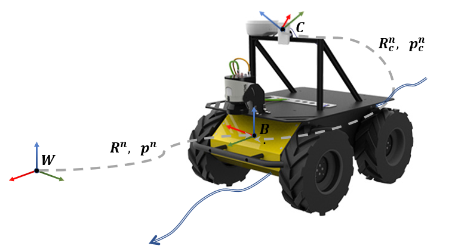

# IMU-encoder Wheeled Robot State Estimation in Slippery Environments Using InEKF

This project aims to estimate the states of a wheel robot in outdoor environments using IMU data, wheel encoder data, and camera measurements. An InEKF based approach is taken to achieve the objective. This project is developed based on the ["Legged Robot State Estimation in Slippery Environments Using Invariant Extended Kalman Filter with Velocity Update"](https://arxiv.org/abs/2104.04238) and the open source code of ["In-EKF"](https://github.com/RossHartley/invariant-ekf).

  

<!-- 

  

 -->

## Getting Started
To run the code, the following environment and dependencies are required: 
- Python == 3.6
- numpy == 1.20.3
- matplotlib == 3.4.3
- scipy == 1.7.1
- pandas == 1.3.4

## Code organization
    .
    ├── data                        # Folder contains the data sets
    ├── data_process                # Folder contains the data sets for Matlab
    ├── inekf                       # 
    ├── results                     # Folder contains final results images
    ├── src                         # Python scripts
    │   ├── helper_func.py          # Helper function
    │   ├── husky_inekf_indoor.py   # Main script of state estimation with In-EKF in indoor environment
    │   ├── husky_inekf_light.py    # Main script of state estimation with In-EKF in parking lot environment
    │   ├── inekf_imu_cameraPos.py	# In-EKF with encoder and camera measurements
    └── README.md

## Running the code
To run the code, run `husky_inekf_light.py`for parking lot environment
<!-- or `husky_inekf_indoor.py` for indoor environment. -->

## Implementations

* See the [report] (put link here) for detailed implementations.

## Results
<!-- 

  

  

  

Results for data set 2 (Downtown):

  

  

  

Results for data set 3 (Rural Area):

  

  

  

 -->

